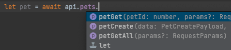
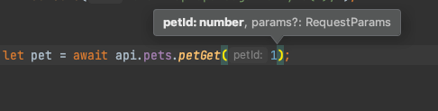
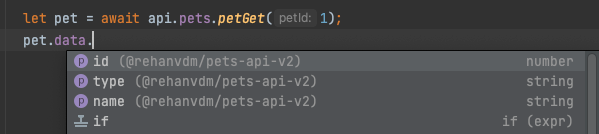
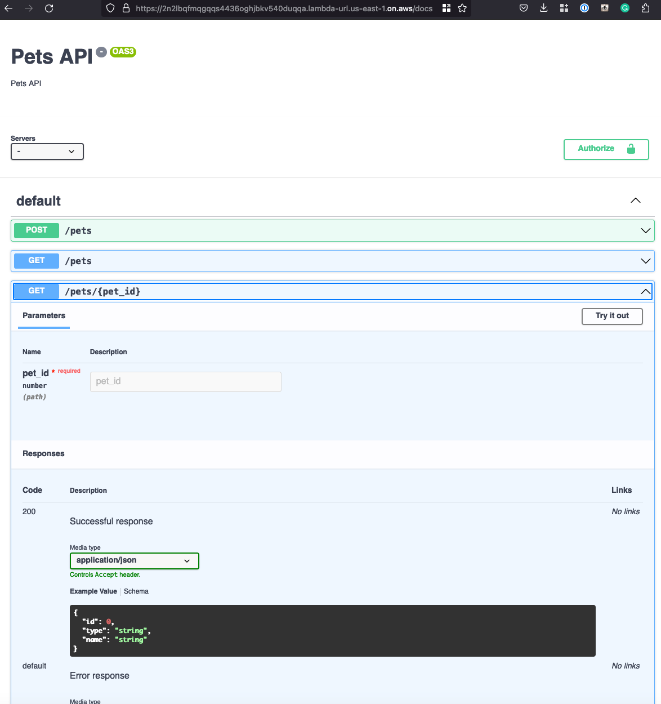

# Frontend

This project is used to demo the usage of the SDK API NPM packaged that is published by the backend project here:
[https://github.com/rehanvdm/pets-backend-v2](https://github.com/rehanvdm/pets-backend-v2). It is a basic Vue app
powered by Vite that uses the API SDK package in the `/views/HomeView.vue` file.

It features the following:
- Showcases the use of [tRPC](https://trpc.io/) indirectly by importing the API SDK that was generated from the
[trpc-openapi](https://github.com/jlalmes/trpc-openapi) package in the backend
- The use of the API SDK package stored on GitHub
- A build system that consists of npm scripts, [wireit](https://github.com/google/wireit) and a custom TS file used to execute commands
- Local development by running the Vite development server
- Other:
  - Uses esbuild and the `esbuild-runner` package instead of `tsc` or `ts-node`
  - Has ESLint + Prettier setup
  - Vite and Vue is used to showcase the usage of the API

## Configuration

1. The configuration is done in the `config/index.ts` file. The file has been committed with actual values for the purpose
of this blog. Replace the values with your own, see description of the types in the file.
2. Change the URL in `.env.production` to your own from the outputs of deploying the `pets-backend-v2` project.


3. Enable pull from GitHub Packages:
   1. Create a [Personal Access Token(PAT) on GitHub](https://docs.github.com/en/authentication/keeping-your-account-and-data-secure/creating-a-personal-access-token#creating-a-token)
      so that we can read the SDK API NPM package. You need to assign the flowing permissions:
      - `read:packages` Read packages to the GitHub Package Registry
   2. Make a copy of the `.npmrc.example` file and replace:
      -`<YOUR PERSONAL ACCESS TOKEN HERE>` with your GitHub Personal Access Token (PAT) that you obtained above
      -`<YOUR GITHUB PROFILE OR ORGANIZATION NAME>` with your GutHub username of where the package is installed
   3. Uninstall the `@rehanvdm/pets-backend-v2` package and install your own published package as defined in the backend
   project.

       ```
       npm install @owner/repo-name
       ```

## Scripts

Useful commands:

- `npm run build-src` - Builds this project source, using Vite and places the result in the `dist` folder.
- `npm run cdk-diff` - Runs `build-src` and then the `cdk diff` command.
- `npm run cdk-deploy` - Runs `build-src` and then the `cdk deploy` command. This deploys the build frontend code to an
S3 bucket and CloudFront distribution.
---
- `npm run dev` - Starts the Vite server in dev mode for local development.
---
- `npm run lint-fix` - Runs eslint and prettier on the project and fixes all linting and formatting issues (also runs
  in the hsuky git pre commit hook).
- `npm run test-unit` - Runs the tests defined in the `/tests` folder.

## Using the API SDK NPM package


Example:
```typescript
import {Api} from "@rehanvdm/pets-api-v2"

const apiBaseUrl = import.meta.env.VITE_API_URL;
const api = new Api({
   baseUrl: apiBaseUrl,
   // baseApiParams: {
   //   headers: {
   //     "Authorization": "<YOUR TOKEN HERE>"
   //   }
   // }
});

let pet = await api.pets.petGet(1);
console.log(pet);
 ```

Note that you get autocomplete for the function (aka API arguments, with proper types) right in your IDE.




The raw OpenAPI spec file can be seen at `node_modules/@rehanvdm/pets-api-v2/openapi.yaml`. Or you can just navigate to the
`/docs` path on the backend API URL.



